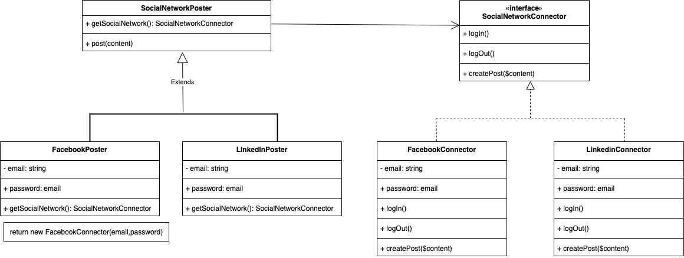

# Facorty Method
Provides an interface for creating objects in superclass, but allow subclasses to alter the type of objects that will be created.

# **UML**

----
### **Real world example**

# **Uses**
- Use the Factory Method when you don’t know beforehand the exact types and dependencies of the objects your code should work with.
- Use the Factory Method when you want to provide users of your library or framework with a way to extend its internal components.
- Use the Factory Method when you want to save system resources by reusing existing objects instead of rebuilding them each time.